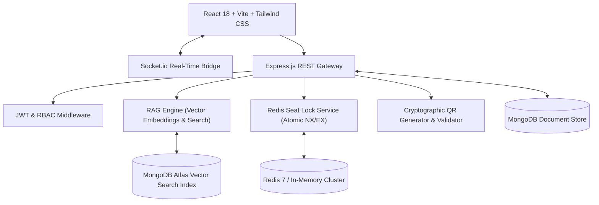

# 🎟️ Venuro — AI-Powered Entertainment Discovery & Booking Platform

[](https://github.com/venuro/venuro/actions)
[](https://reactjs.org/)
[](https://nodejs.org/)
[](https://redis.io/)
[](https://mongodb.com/)
[](https://docker.com/)
[](https://aws.amazon.com/)

**Venuro** is an enterprise full-stack entertainment discovery and booking platform for movies, stadium concerts, cricket/sports tournaments, standup comedy, and immersive VR experiences. It features dedicated workflows for **Users**, **Event Coordinators**, and **Platform Administrators**, real-time Redis seat locking, double-booking prevention, digital QR tickets, automated refunds, and an intelligent **AI RAG (Retrieval-Augmented Generation)** discovery assistant.

---

## 🌟 Key Features

### 1. 👥 Multi-Role Workflows (1-Click Instant Demo Switcher)
- **Guest / User**: Explore shows across 5 categories, chat with AI, select seats with real-time locks, pay with simulated payment methods, view digital QR tickets, and request cancellations with instant wallet refunds.
- **Event Coordinator**: Create new events, schedule showtime slots, view sales & revenue metrics, and scan guest QR passes using the **Gate Admission Scanner**.
- **Platform Admin**: Monitor Gross Merchandise Value (GMV), net revenue, seat occupancy rates, moderate events, assign user roles, and inspect Redis & vector AI system health.

### 2. 💺 Real-Time Seat Selection & 5-Minute Redis Locking
- **Interactive Multi-Tier Seat Map**: Visual matrix across **VIP (₹1500)**, **Premium (₹900)**, **Standard (₹500)**, and **Economy (₹250)**.
- **Atomic Concurrency Control**: Uses atomic Redis locks (`SET NX EX 300`) with 5-minute countdown timers.
- **Zero Double-Booking Guarantee**: Conflicting reservation attempts are instantly rejected.
- **Live Sync**: Socket.io real-time broadcast (`seats_updated`) updates all connected clients looking at the same show.

### 3. 💳 Simulated Checkout, Automated Refunds & Verifiable QR Tickets
- **Simulated Payment Gateway**: Card, UPI / QR, Net Banking, and Venuro Wallet with promo coupon engine (`VENURO20`, `FIRSTSHOW`).
- **Cryptographic QR Passes**: Every booking generates an HMAC-signed QR Code containing booking metadata.
- **Dynamic Refund Policy**:
  - `> 24 hours` before show: **100% full refund**
  - `4 - 24 hours` before show: **70% refund**
  - `< 4 hours` before show: Non-refundable
  - Automated refund credits instantly deposited into user's **Venuro Wallet**.

### 4. 🤖 AI-Powered RAG Assistant & Vector Search
- **Natural Language Discovery**: Ask *"Find Coldplay concerts in Mumbai"*, *"Recommend comedy shows under ₹1000"*, or *"What movies are in English and Hindi?"*.
- **Domain Grounded Q&A**: Knowledge-base retrieval for venue rules, prohibited items, wheelchair access, and refund policies.
- **Inline Interactive Event Cards**: AI renders clickable booking cards directly in the chat stream with suggested follow-ups.

---

## 🏗️ System Architecture



---

## 🚀 Quick Start Guide

### Prerequisites
- **Node.js**: v18+ (tested on Node v20/v24)
- **npm**: v9+

### Option A: Local Development (Fastest)

1. **Clone the repository**:
   ```bash
   git clone https://github.com/your-username/venuro.git
   cd venuro
   ```

2. **Start Backend Server**:
   ```bash
   cd server
   npm install
   npm start
   ```
   *The server automatically boots on `http://localhost:5000` with pre-seeded demo catalog, accounts, and in-memory Redis engine.*

3. **Start Frontend Client**:
   ```bash
   cd ../client
   npm install
   npm run dev
   ```
   *Access the application at `http://localhost:3000`.*

---

### Option B: Docker & Docker Compose

Run the complete multi-container stack (Client, Server, Redis, MongoDB) with a single command:
```bash
docker-compose up --build
```
- **Web Application**: `http://localhost:3000`
- **Backend API**: `http://localhost:5000/api`
- **Health Check**: `http://localhost:5000/api/health`

---

## 🧪 Running Automated Test Suite

Run the full end-to-end service test suite (Auth, Catalog, Redis Locking, QR Signatures, AI RAG):
```bash
cd server
npm test
```

---

## 🔑 Seeded Demo Credentials

| Role | Email | Password | Key Privileges |
|---|---|---|---|
| 👤 **User** | `user@venuro.com` | `password123` | Discovery, 5-min seat locking, bookings, wallet, cancellations |
| 🎪 **Coordinator** | `coordinator@venuro.com` | `password123` | Create events, schedule showtimes, live QR Gate Scanner |
| 🛡️ **Admin** | `admin@venuro.com` | `password123` | Platform GMV metrics, user role governance, Redis health |

*(You can also use the **1-Click Demo Buttons** on the Navbar or Sign In page for instant role switching without typing credentials!)*

---

## 📡 REST API Reference

### Authentication & Profiles
| Method | Endpoint | Description | Role |
|---|---|---|---|
| `POST` | `/api/auth/register` | Register new user account | Public |
| `POST` | `/api/auth/login` | Login with email and password | Public |
| `POST` | `/api/auth/demo-login` | 1-Click login for User / Coordinator / Admin | Public |
| `GET` | `/api/auth/me` | Retrieve authenticated user profile | Authenticated |

### Events & Shows
| Method | Endpoint | Description | Role |
|---|---|---|---|
| `GET` | `/api/events` | List events with category, city & search filters | Public |
| `GET` | `/api/events/:id` | Get event details, showtimes & reviews | Public |
| `POST` | `/api/events` | Create a new entertainment event | Coordinator / Admin |
| `GET` | `/api/shows/event/:eventId` | Get scheduled showtimes for an event | Public |
| `GET` | `/api/shows/:showId/seat-map`| Get live seat grid + active Redis locks | Public / User |
| `POST` | `/api/shows` | Add new showtime slot for an event | Coordinator / Admin |

### Bookings & Concurrency
| Method | Endpoint | Description | Role |
|---|---|---|---|
| `POST` | `/api/bookings/lock-seats` | Acquire 5-minute atomic Redis lock for seats | User |
| `POST` | `/api/bookings/release-seats` | Release temporary seat locks | User |
| `POST` | `/api/bookings/checkout` | Process payment & generate cryptographic QR ticket | User |
| `GET` | `/api/bookings/my-bookings` | Retrieve user's active/past bookings | User |
| `POST` | `/api/bookings/:id/cancel` | Cancel booking & trigger automated refund | User |
| `POST` | `/api/bookings/verify-qr` | Scan & verify gate admission QR code | Coordinator / Admin |

### AI RAG Assistant & Recommendations
| Method | Endpoint | Description | Role |
|---|---|---|---|
| `POST` | `/api/ai/chat` | Natural language event discovery & policy Q&A | Public / User |
| `GET` | `/api/ai/recommendations` | Vector-similarity personalized recommendations | User |

### Admin & Governance
| Method | Endpoint | Description | Role |
|---|---|---|---|
| `GET` | `/api/admin/analytics` | Gross Merchandise Value, revenue & audit metrics | Admin |
| `GET` | `/api/admin/users` | List all users and assigned roles | Admin |
| `PUT` | `/api/admin/users/:id/role` | Promote/change user authorization role | Admin |
| `GET` | `/api/admin/health` | Redis locks, memory telemetry & system uptime | Admin |

---

## ☁️ Cloud Deployment (AWS & CI/CD)
See [aws-deployment.md](aws-deployment.md) for full instructions on configuring:
- **AWS ECS Fargate** container services
- **Amazon ElastiCache** Redis clusters
- **MongoDB Atlas** Vector Search integration
- **GitHub Actions** CI/CD pipeline (`.github/workflows/ci-cd.yml`)
