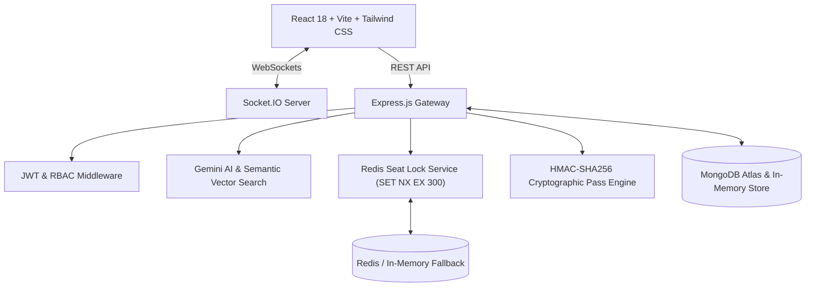

# 🎟️ Venuro — Entertainment Discovery & Real-Time Event Booking Platform

[](https://github.com/vishwambhar-kinage/venuro/actions)
[](https://react.dev/)
[](https://nodejs.org/)
[](https://expressjs.com/)
[](https://www.mongodb.com/)
[](https://redis.io/)
[](https://www.docker.com/)

**Venuro** is a full-stack entertainment discovery and booking platform built with the MERN stack. It features a 3-tier Role-Based Access Control (RBAC) architecture (**Customer**, **Organizer / Coordinator**, **Admin**), sub-second distributed seat locking powered by Redis (`SET NX EX 300`), real-time Socket.IO broadcasts, cryptographic QR tickets (HMAC-SHA256), and an AI discovery copilot powered by Google Gemini 1.5 Flash and vector cosine similarity search.

---

## 🌟 Architecture & Core Features

### 1. 👥 Multi-Role Architecture & Lifecycle Management
- **Customer**: Browse categorized catalog (Movies, Concerts, Sports, Live Shows), interactive seat reservation, digital ticket wallet, and cancellation workflows with instant wallet refunds.
- **Event Organizer**: Event creation lifecycle (`DRAFT` &rarr; `PENDING_APPROVAL` &rarr; `PUBLISHED`), show scheduling, ticket sales monitoring, and gate QR admission scanning.
- **Admin**: Platform-wide GMV analytics, organizer approval queues, event moderation, and system telemetry.

### 2. 💺 High-Concurrency Distributed Seat Locking
- **Zero Double-Booking Guarantee**: Implements atomic **Redis `SET NX EX 300`** distributed locking to hold selected seats for exactly 5 minutes during checkout.
- **Real-Time Synchronization**: **Socket.IO** room broadcasts immediately reflect seat locks across all connected clients.
- **Automatic TTL Expiry**: Abandoned checkout sessions automatically release locked seats without manual intervention.

### 3. 🤖 AI Discovery Assistant & Vector Search
- **Conversational Copilot**: Integrated with **Google Gemini 1.5 Flash** for natural language event queries, venue recommendations, and budget filtering.
- **Domain-Grounded RAG**: Vector cosine similarity search against structured platform policies (refund tiers, venue rules, seating categories).

### 4. 💳 Cryptographic Passes & Automated Refund Engine
- **Tamper-Proof QR Tickets**: Confirmed bookings generate a cryptographically signed HMAC-SHA256 QR pass for offline gate verification.
- **Tiered Refund Workflow**: Automated calculation based on showtime proximity (>24h: 100%, 4–24h: 70%, <4h: non-refundable) credited directly to user wallets.

---

## 🏗️ System Design



---

## 🚀 Quick Start Guide

### Prerequisites
- **Node.js**: v18.0 or higher
- **npm**: v9.0 or higher

### Option A: Local Development

1. **Clone the Repository:**
   ```bash
   git clone https://github.com/vishwambhar-kinage/venuro.git
   cd venuro
   ```

2. **Start Backend Server:**
   ```bash
   cd server
   npm install
   npm start
   ```
   *Runs on `http://localhost:5000` with automated database and Redis fallback engine.*

3. **Start Frontend Client:**
   ```bash
   cd ../client
   npm install
   npm run dev
   ```
   *Access the web application at `http://localhost:3000`.*

---

### Option B: Docker Compose

Run the entire multi-container stack (Client, Server, Redis, MongoDB) with a single command:
```bash
docker-compose up --build
```
- **Web Client**: `http://localhost:3000`
- **REST API**: `http://localhost:5000/api`
- **Health Endpoint**: `http://localhost:5000/api/health`

---

## 🧪 Automated Testing

Run the end-to-end test suite (Auth, Catalog, Redis Locking, QR Signatures, and RAG):
```bash
cd server
npm test
```

---

## 🔐 Role Access Endpoints

| Portal Role | Route | Access Description |
| :--- | :--- | :--- |
| **Customer** | `/auth` | Public catalog browsing, seat reservation, wallet & QR passes |
| **Organizer** | `/organizer/login` | Event submission, showtime scheduling, gate admission scanner |
| **Admin** | `/admin/login` | Platform analytics, approval workflows, user governance |

---

## 📡 REST API Reference

### Authentication & RBAC
- `POST /api/auth/register` — Register customer account
- `POST /api/auth/login` — Authenticate and receive JWT token
- `GET /api/auth/me` — Retrieve active user session profile

### Events & Shows
- `GET /api/events` — Query published events with category & city filters
- `GET /api/events/:id` — Event details, cast, crew, and scheduled showtimes
- `POST /api/events` — Create new event (Organizer/Admin)
- `GET /api/shows/:showId/seat-map` — Real-time seat availability matrix

### Concurrency & Bookings
- `POST /api/shows/:showId/lock` — Acquire Redis lock for selected seats (`NX EX 300`)
- `POST /api/shows/:showId/unlock` — Release held seat locks
- `POST /api/payment/verify` — Verify HMAC payment signature and confirm booking
- `POST /api/bookings/:id/cancel` — Trigger automated refund workflow

### AI Discovery & Search
- `POST /api/ai/chat` — Gemini 1.5 Flash conversational discovery copilot
- `GET /api/ai/semantic-search` — Vector cosine similarity search query

---

## 📄 License
This project is licensed under the MIT License.
