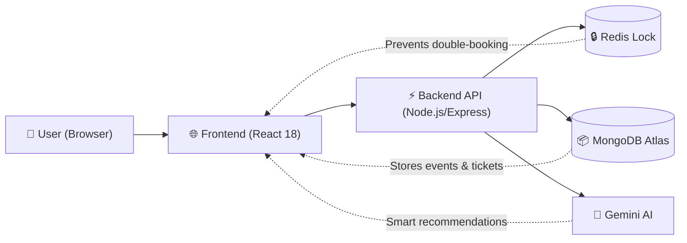
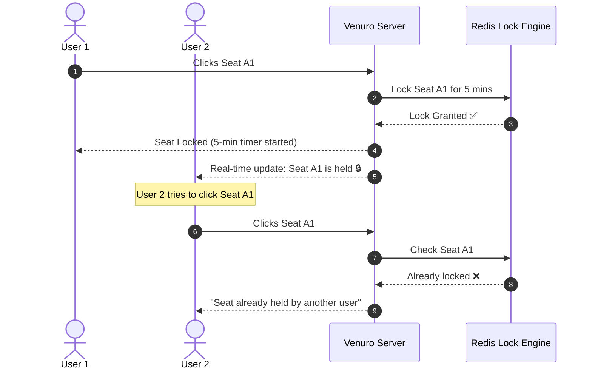

# 🎟️ Venuro — AI-Powered Entertainment Discovery & Booking Platform

[](https://github.com/vishwambhar-kinage/venuro/actions)
[](https://react.dev/)
[](https://nodejs.org/)
[](https://expressjs.com/)
[](https://www.mongodb.com/)
[](https://redis.io/)
[](https://www.docker.com/)

**Venuro** is an AI-powered entertainment discovery and real-time event booking platform (similar to BookMyShow). It allows users to discover movies, concerts, sports tournaments, and live shows, select seats in real time with zero risk of double-booking, and get instant recommendations through an AI booking assistant.

---

## 💡 Quick Overview: How Venuro Works



---

## 🌟 Key Features

### 1. 👥 3-Tier Multi-Role System (RBAC)
- **Customer**: Browse events, pick seats on an interactive seat map, chat with AI, pay securely, and get a digital QR ticket.
- **Organizer**: Create events, schedule showtimes, track ticket sales, and verify tickets at the venue using a QR scanner.
- **Admin**: Approve or reject newly created events, track total platform revenue (GMV), and monitor system performance.

---

### 2. 💺 Real-Time Seat Locking (Zero Double-Booking)
- When a user clicks a seat, **Redis temporarily locks it for 5 minutes** (`SET NX EX 300`).
- **Live Sync**: Through **Socket.IO**, other users immediately see that seat turn yellow (held) or red (booked).
- **Auto-Release**: If the user does not pay within 5 minutes, the seat automatically becomes available again.



---

### 3. 🤖 AI Discovery Assistant (Venu AI)
- Built with **Google Gemini 1.5 Flash** and semantic vector search.
- **Natural Language Search**: Ask *"Find rock concerts in Mumbai"* or *"Show me action movies under ₹500"*.
- **Instant Answers**: Understands platform policies like cancellation rules, refund timelines, and venue guidelines.

---

### 4. 🎟️ Tamper-Proof QR Tickets & Instant Refunds
- **Cryptographic Passes**: Every confirmed ticket generates an **HMAC-SHA256 signed QR code** that cannot be forged.
- **Automated Refund Engine**:
  - `> 24 hours` before show: **100% full refund**
  - `4 - 24 hours` before show: **70% refund**
  - `< 4 hours` before show: Non-refundable
  - Refunds are instantly credited back to the user's **Venuro Wallet**.

---

## 🚀 Quick Start Guide

### Prerequisites
- **Node.js**: v18+
- **npm**: v9+

### Run Locally in 2 Steps:

```bash
# 1. Clone repository
git clone https://github.com/vishwambhar-kinage/venuro.git
cd venuro

# 2. Run Backend (Port 5000)
cd server
npm install
npm start

# 3. In another terminal, run Frontend (Port 3000)
cd client
npm install
npm run dev
```
Open **`http://localhost:3000`** in your browser.

---

### Run with Docker in 1 Step:

```bash
docker-compose up --build
```
- **Web App**: `http://localhost:3000`
- **Backend API**: `http://localhost:5000/api`

---

## 🧪 Automated Testing

Run the test suite covering authentication, seat locking, QR verification, and AI responses:
```bash
cd server
npm test
```

---

## 🔐 Portal Access Routes

| Role | Portal Link | Description |
| :--- | :--- | :--- |
| **Customer** | `/auth` | Event discovery, seat reservation, wallet & digital tickets |
| **Organizer** | `/organizer/login` | Event creation, sales metrics, live gate QR ticket scanner |
| **Admin** | `/admin/login` | Revenue analytics, event approval queues, user management |

---

## 📡 Key REST API Endpoints

- `POST /api/auth/register` — Register a customer account
- `POST /api/auth/login` — Login and receive JWT token
- `GET  /api/events` — Get published events with category & city filters
- `GET  /api/shows/:showId/seat-map` — View live seat availability grid
- `POST /api/shows/:showId/lock` — Temporarily lock selected seats (5 mins)
- `POST /api/payment/verify` — Verify payment signature and generate QR ticket
- `POST /api/bookings/:id/cancel` — Cancel booking and process wallet refund
- `POST /api/ai/chat` — Ask Venu AI for smart recommendations
