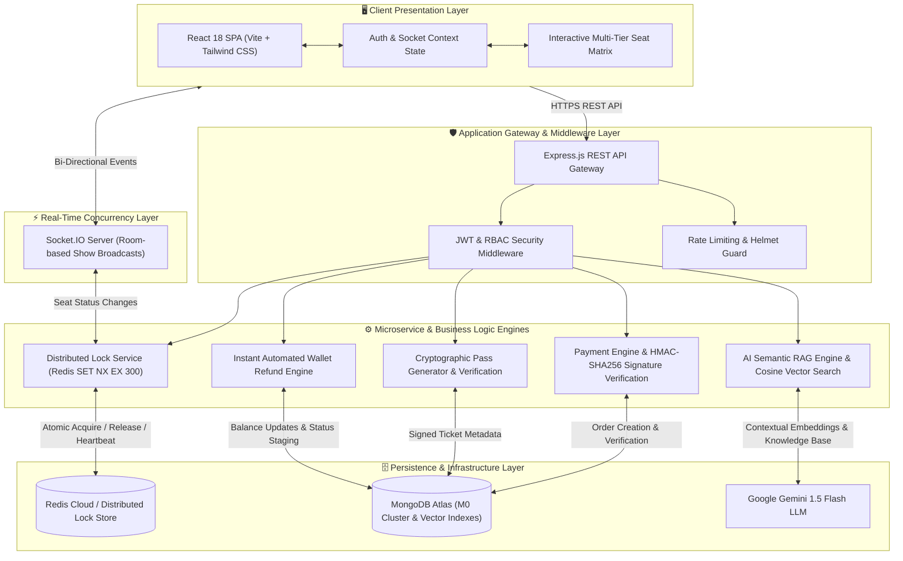
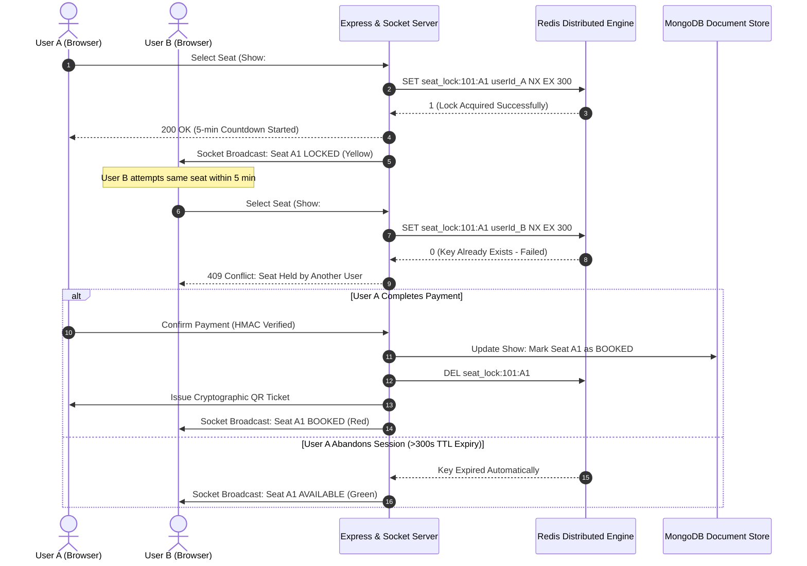

# 🎟️ Venuro — Entertainment Discovery & Real-Time Event Booking Platform

[](https://github.com/vishwambhar-kinage/venuro/actions)
[](https://react.dev/)
[](https://nodejs.org/)
[](https://expressjs.com/)
[](https://www.mongodb.com/)
[](https://redis.io/)
[](https://www.docker.com/)

**Venuro** is an enterprise full-stack entertainment discovery and booking platform engineered for high-concurrency ticket reservation workloads. It features a 3-tier Role-Based Access Control (RBAC) architecture (**Customer**, **Organizer / Coordinator**, **Admin**), sub-second distributed seat locking powered by Redis (`SET NX EX 300`), real-time Socket.IO synchronization, cryptographic digital ticket issuance (HMAC-SHA256), automated tiered refund workflows, and an AI discovery copilot powered by Google Gemini 1.5 Flash and vector cosine similarity search.

---

## 🏗️ System Architecture & Engineering Design

The platform uses a decoupled microservices architecture designed to eliminate race conditions under spike traffic and ensure zero double-booking during high-demand event releases.



---

## ⚡ High-Concurrency Distributed Seat Locking Flow

During high-volume ticket drops, hundreds of concurrent users may attempt to reserve the same seat simultaneously. Venuro solves this with distributed Redis locks:



---

## 🌟 Key Technical Highlights

### 1. 👥 Multi-Role Architecture & Staging Lifecycle
- **Customer**: Categorized catalog discovery, budget filtering, live seat reservations, and wallet management.
- **Event Organizer**: Event creation lifecycle (`DRAFT` &rarr; `PENDING_APPROVAL` &rarr; `PUBLISHED`), show scheduling, sales dashboards, and gate QR admission scanning.
- **Platform Admin**: Platform GMV analytics, approval queues, event moderation, and system telemetry.

### 2. 💺 Concurrency & Double-Booking Prevention
- **Atomic Operations**: Redis `SET NX EX 300` guarantees that only one request can acquire a seat lock, even under race conditions.
- **Real-Time Synchronization**: Socket.IO broadcasts updates to all active sessions in the same show room.
- **Heartbeat & TTL**: Abandoned checkout sessions automatically expire after 300 seconds, returning seats to the available pool.

### 3. 🤖 AI Discovery Assistant & Vector Search
- **Conversational Booking Copilot**: Powered by **Google Gemini 1.5 Flash** for natural language recommendations, cast searches, and venue inquiries.
- **Semantic RAG Engine**: Vector cosine similarity search calculates matching scores across platform knowledge base documents (venue accessibility, parking, refund policies).

### 4. 💳 Cryptographic Passes & Automated Refunds
- **HMAC-SHA256 QR Passes**: Digital tickets contain cryptographically signed payloads that prevent forged passes and enable fast offline verification.
- **Tiered Refund Automation**:
  - `> 24 hours` before showtime: **100% full refund**
  - `4 - 24 hours` before showtime: **70% partial refund**
  - `< 4 hours` before showtime: Non-refundable policy
  - Instant automated deposits directly to the user's **Venuro Wallet**.

---

## 🚀 Deployment & Local Setup

### Prerequisites
- **Node.js**: v18.0 or higher
- **npm**: v9.0 or higher

### Option A: Local Development

```bash
# 1. Clone the repository
git clone https://github.com/vishwambhar-kinage/venuro.git
cd venuro

# 2. Start Backend Server (Port 5000)
cd server
npm install
npm start

# 3. Start Frontend Client (Port 3000)
cd ../client
npm install
npm run dev
```

### Option B: Docker Compose Multi-Container Stack

```bash
docker-compose up --build
```
- **Web Application**: `http://localhost:3000`
- **Backend API Gateway**: `http://localhost:5000/api`
- **Health Telemetry**: `http://localhost:5000/api/health`

---

## 🧪 Automated Testing Suite

Run the end-to-end integration and unit test suite (Auth RBAC, Redis Locking, QR Signatures, and RAG):
```bash
cd server
npm test
```

---

## 🔐 Role Access Endpoints

| Portal Role | Route | Access Level |
| :--- | :--- | :--- |
| **Customer** | `/auth` | Public catalog browsing, seat reservation, wallet & QR passes |
| **Organizer** | `/organizer/login` | Event submission, showtime scheduling, gate admission scanner |
| **Admin** | `/admin/login` | Platform analytics, approval workflows, user governance |

---

## 📡 REST API Gateway Reference

### Authentication & RBAC
- `POST /api/auth/register` — Register customer account
- `POST /api/auth/login` — Authenticate and receive JWT token
- `GET /api/auth/me` — Retrieve active user session profile

### Events & Shows
- `GET /api/events` — Query published events with category & city filters
- `GET /api/events/:id` — Event details, cast, crew, and scheduled showtimes
- `POST /api/events` — Create new event (Organizer/Admin)
- `GET /api/shows/:showId/seat-map` — Real-time seat availability matrix

### Concurrency & Bookings
- `POST /api/shows/:showId/lock` — Acquire Redis lock for selected seats (`NX EX 300`)
- `POST /api/shows/:showId/unlock` — Release held seat locks
- `POST /api/payment/verify` — Verify HMAC payment signature and confirm booking
- `POST /api/bookings/:id/cancel` — Trigger automated refund workflow

### AI Discovery & Search
- `POST /api/ai/chat` — Gemini 1.5 Flash conversational discovery copilot
- `GET /api/ai/semantic-search` — Vector cosine similarity search query
