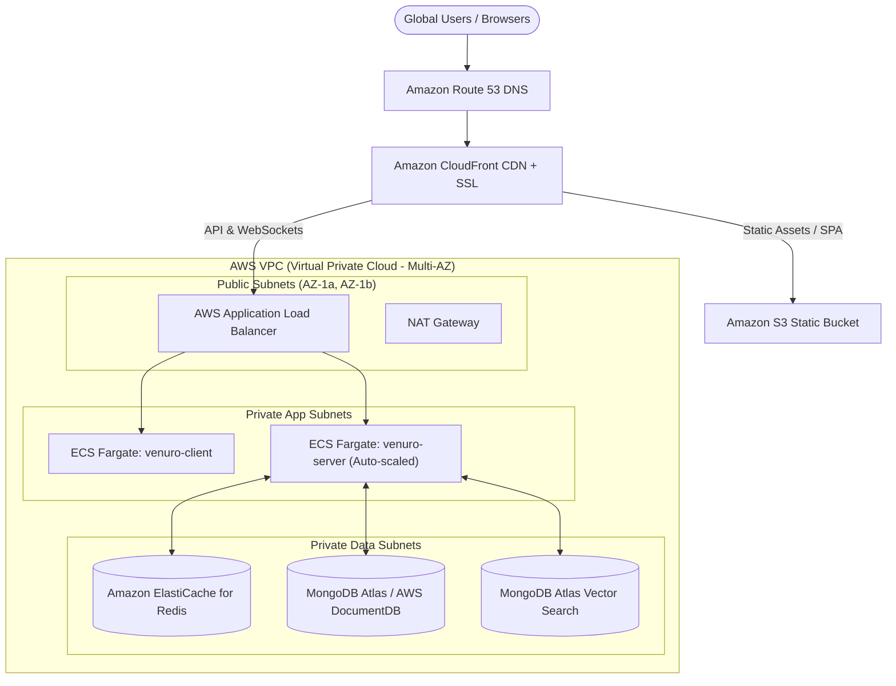

# ☁️ Venuro — AWS Cloud Architecture & Deployment Guide

This document provides complete instructions and architectural blueprints for deploying **Venuro** on **Amazon Web Services (AWS)** using containerized microservices, managed databases, caching, and CI/CD automation.

---

## 🏛️ Cloud Architecture Topology



---

## 🚀 AWS Services Breakdown

| Component | AWS Service | Purpose |
|---|---|---|
| **DNS & Routing** | Amazon Route 53 | High-availability global domain DNS management with latency routing |
| **Edge & CDN** | Amazon CloudFront | Sub-millisecond static caching, edge TLS termination, DDoS shield |
| **Compute & Containers** | AWS ECS Fargate | Serverless container orchestration for `venuro-server` & `venuro-client` |
| **Load Balancing** | Application Load Balancer (ALB) | SSL/TLS offloading, path-based routing (`/api/*`, `/socket.io/*`) |
| **Concurrency & Caching**| Amazon ElastiCache (Redis) | Multi-AZ Redis cluster for atomic 5-min seat locks and TTL keys |
| **Database & Vectors** | MongoDB Atlas / DocumentDB | Document store + Vector Search index for RAG embeddings |
| **Container Registry** | Amazon ECR | Private Docker image registry with vulnerability scanning |
| **CI/CD** | GitHub Actions + AWS IAM | Automated testing, Docker building, and rolling ECS zero-downtime deployments |
| **Secrets & Config** | AWS Secrets Manager | Secure management of JWT secrets, Mongo URIs, and HMAC QR keys |

---

## 📦 Container Task Definition Template (`aws/ecs-task-definition.json`)

```json
{
  "family": "venuro-production-task",
  "networkMode": "awsvpc",
  "requiresCompatibilities": ["FARGATE"],
  "cpu": "1024",
  "memory": "2048",
  "executionRoleArn": "arn:aws:iam::ACCOUNT_ID:role/ecsTaskExecutionRole",
  "taskRoleArn": "arn:aws:iam::ACCOUNT_ID:role/venuroTaskRole",
  "containerDefinitions": [
    {
      "name": "venuro-server",
      "image": "ACCOUNT_ID.dkr.ecr.us-east-1.amazonaws.com/venuro-server:latest",
      "essential": true,
      "portMappings": [
        {
          "containerPort": 5000,
          "protocol": "tcp"
        }
      ],
      "environment": [
        { "name": "NODE_ENV", "value": "production" },
        { "name": "PORT", "value": "5000" }
      ],
      "secrets": [
        {
          "name": "MONGODB_URI",
          "valueFrom": "arn:aws:secretsmanager:us-east-1:ACCOUNT_ID:secret:venuro/MONGODB_URI"
        },
        {
          "name": "REDIS_URL",
          "valueFrom": "arn:aws:secretsmanager:us-east-1:ACCOUNT_ID:secret:venuro/REDIS_URL"
        },
        {
          "name": "JWT_SECRET",
          "valueFrom": "arn:aws:secretsmanager:us-east-1:ACCOUNT_ID:secret:venuro/JWT_SECRET"
        },
        {
          "name": "QR_SECRET",
          "valueFrom": "arn:aws:secretsmanager:us-east-1:ACCOUNT_ID:secret:venuro/QR_SECRET"
        }
      ],
      "logConfiguration": {
        "logDriver": "awslogs",
        "options": {
          "awslogs-group": "/ecs/venuro-production",
          "awslogs-region": "us-east-1",
          "awslogs-stream-prefix": "server"
        }
      }
    }
  ]
}
```

---

## 🛠️ Step-by-Step Deployment Guide

### 1. Build and Push Containers to Amazon ECR
```bash
# Authenticate Docker to Amazon ECR
aws ecr get-login-password --region us-east-1 | docker login --username AWS --password-stdin <AWS_ACCOUNT_ID>.dkr.ecr.us-east-1.amazonaws.com

# Create ECR Repositories
aws ecr create-repository --repository-name venuro-server
aws ecr create-repository --repository-name venuro-client

# Tag and Push Backend
docker build -t venuro-server ./server
docker tag venuro-server:latest <AWS_ACCOUNT_ID>.dkr.ecr.us-east-1.amazonaws.com/venuro-server:latest
docker push <AWS_ACCOUNT_ID>.dkr.ecr.us-east-1.amazonaws.com/venuro-server:latest

# Tag and Push Frontend
docker build -t venuro-client ./client
docker tag venuro-client:latest <AWS_ACCOUNT_ID>.dkr.ecr.us-east-1.amazonaws.com/venuro-client:latest
docker push <AWS_ACCOUNT_ID>.dkr.ecr.us-east-1.amazonaws.com/venuro-client:latest
```

### 2. Configure AWS ElastiCache for Redis
1. Navigate to **Amazon ElastiCache** console.
2. Create a **Redis Cluster** with:
   - Node Type: `cache.t4g.micro` (or `cache.r6g.large` for high concurrency)
   - Multi-AZ with Automatic Failover: **Enabled**
   - Cluster Mode: Enabled
   - Subnet Group: Private App Subnets.

### 3. Deploy ECS Fargate Service
1. Create an ECS Cluster: `venuro-production-cluster`.
2. Register the task definition from `aws/ecs-task-definition.json`.
3. Create an ECS Fargate Service behind the Application Load Balancer with Target Tracking Auto Scaling based on CPU/Memory utilization (>70%).

### 4. Setup GitHub Actions Secrets for Automated CI/CD
Add the following repository secrets under **GitHub Repository -> Settings -> Secrets and variables -> Actions**:
- `AWS_ACCESS_KEY_ID`: IAM user access key with ECR & ECS deploy policies
- `AWS_SECRET_ACCESS_KEY`: IAM user secret key
- `AWS_REGION`: e.g. `us-east-1`
- `ECR_REPOSITORY`: `venuro-server`
